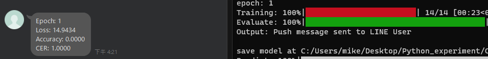

# Go_project

This is a pratice with Python and Golang. When I'm off work, I can receive relevant training metrics about model training on my computer in a timely manner.

## Table of Contents

- [Usage](#usage)
- [Configuration](#configuration)
- [Support and Feedback](#support-and-feedback)

# Usage

`python push_msg.py` 

If you need push mesage to Line bot in your train.py, you can call `from push_msg import push_msg` and pass the relevant parameters to push_msg.

# Configuration

There is an .env file in GoPost.

`CHANNEL_SECRET`: Enter the Channel secret from the `Basic settings` page. 
`CHANNEL_ACCESS_TOKEN`: Enter the Channel access token from the `Messaging API` page. 
`USERID`: Enter the userID from the `Basic settings` page.

# Example

# Support and Feedback

If you encounter issues or have questions, please open an issue.
For general feedback or contact, you can reach out to main668888@gmail.com.

# Reference
https://blog.epoch.tw/2020/11/%E4%BD%BF%E7%94%A8-Go-%E5%BB%BA%E7%AB%8B-LINE-Bot-%E8%81%8A%E5%A4%A9%E6%A9%9F%E5%99%A8%E4%BA%BA/
